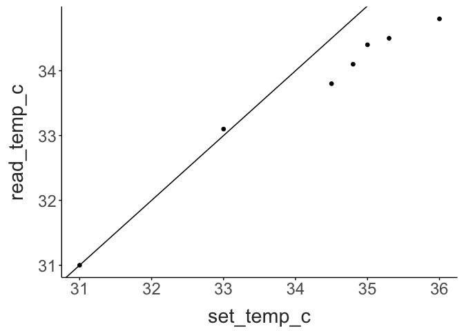
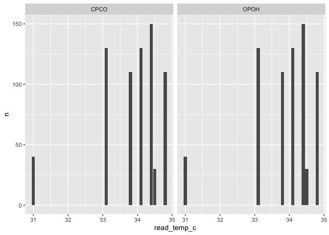
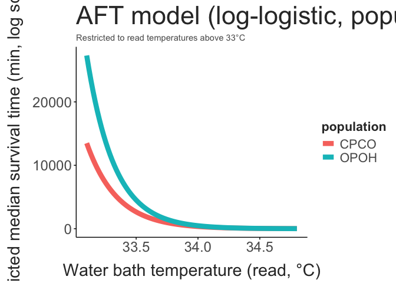
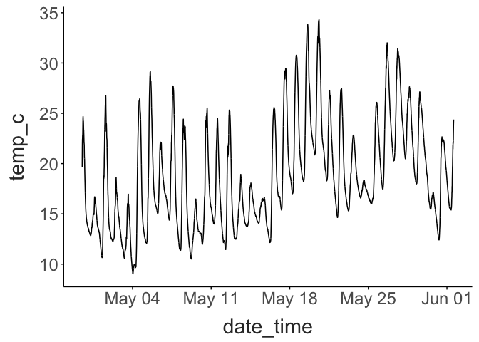
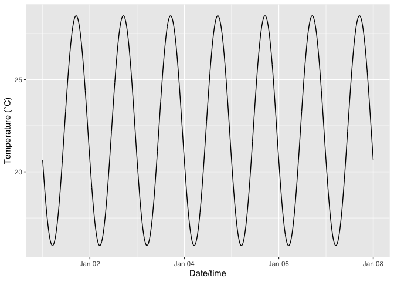
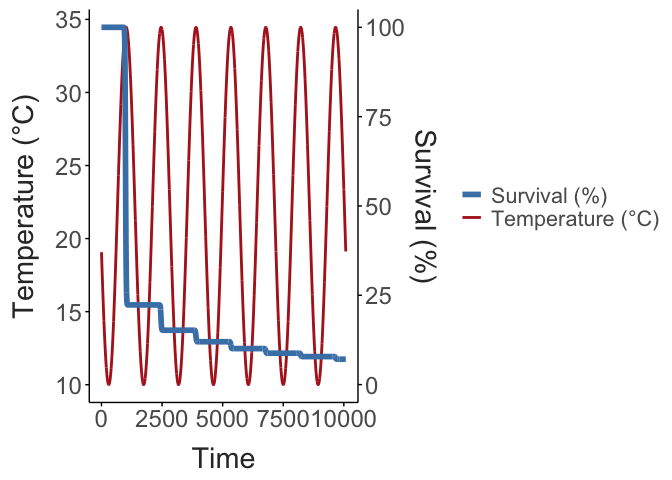

Thermal Tolerance Landscapes of *Skistodiaptomus pallidus*
================
2026-09-27

- [Building the survival dataset](#building-the-survival-dataset)
- [All data](#all-data)
- [Just temperatures above 33°C](#just-temperatures-above-33c)
- [Tolerance Landscape Parameters](#tolerance-landscape-parameters)
  - [Dynamic Landscapes](#dynamic-landscapes)
- [Mortality under variable
  temperatures](#mortality-under-variable-temperatures)
  - [Example 1](#example-1)
  - [Example 2](#example-2)

When setting up the experiments, there is often a slight offset between
the temperature observed in the wells and the set temperature of the
water bath. For these analyses, we will use the temperature read from
the water bath, not the set temperature.

``` r

raw_data |> 
  select(set_temp_c, read_temp_c) |> 
  distinct() |> 
  ggplot(aes(x = set_temp_c, y = read_temp_c)) + 
  geom_abline(intercept = 0, slope = 1) + 
  geom_point() + 
  theme_matt()
```



The number of observations at each temperature for each population is
shown below.

``` r

raw_data |> group_by(source_file) |> 
  count(population, read_temp_c) |> 
  ggplot(aes(x = read_temp_c, y = n)) + 
  facet_wrap(population~.) + 
  geom_bar(stat = "identity")
```



## Building the survival dataset

Individuals are checked for survival at regular intervals during the
experiments. In the resulting data, `responding == "no"` indicates
death: the death time is the first timepoint at which an individual is
recorded as not responding, or, if it never stops responding, the last
observed timepoint (right-censored). Rows flagged for data-quality
issues (`flagged == "yes"`) are excluded before constructing the
time-to-event record for each individual. The actual measured bath
temperature (`read_temp_c`) is used as the temperature covariate rather
than the nominal `set_temp_c`, since the two diverge noticeably at
higher target temperatures.

``` r

surv_data = raw_data |>
  filter(flagged != "yes" | is.na(flagged)) |>
  arrange(source_file, water_bath_id, stopwatch_start_time, well_id, timepoint_min) |>
  group_by(source_file, water_bath_id, stopwatch_start_time, well_id, population, read_temp_c) |>
  summarise(
    time = if (any(responding == "no")) min(timepoint_min[responding == "no"]) else max(timepoint_min),
    event = as.integer(any(responding == "no")),
    n_obs = n(),
    .groups = "drop"
  )

surv_data
## # A tibble: 135 × 9
##    source_file water_bath_id stopwatch_start_time well_id population read_temp_c  time event n_obs
##          <int> <chr>         <dttm>               <chr>   <chr>            <dbl> <dbl> <int> <int>
##  1           1 WB-1          2026-08-20 14:26:09  A1      CPCO                31    30     0     4
##  2           1 WB-1          2026-08-20 14:26:09  A2      OPOH                31    30     0     4
##  3           1 WB-1          2026-08-20 14:26:09  A3      CPCO                31    30     0     4
##  4           1 WB-1          2026-08-20 14:26:09  A4      OPOH                31    30     0     4
##  5           1 WB-1          2026-08-20 14:26:09  A5      CPCO                31    30     0     4
##  6           1 WB-1          2026-08-20 14:26:09  B1      OPOH                31    30     0     4
##  7           1 WB-1          2026-08-20 14:26:09  B2      CPCO                31    30     0     4
##  8           1 WB-1          2026-08-20 14:26:09  B3      CPCO                31    30     0     4
##  9           1 WB-1          2026-08-20 14:26:09  B4      OPOH                31    30     0     4
## 10           1 WB-1          2026-08-20 14:26:09  B5      CPCO                31    30     0     4
## # ℹ 125 more rows
```

## All data

Individual survival times are modeled jointly across all temperatures
using an accelerated failure time (AFT) model, rather than fitting
separate Kaplan-Meier curves per temperature, since many
temperature/population cells have only 10 individuals. Weibull,
log-normal, and log-logistic distributions are compared by AIC.

``` r
dists = c("weibull", "lognormal", "loglogistic")

aic_table = map_dfr(dists, function(d) {
  m = survreg(Surv(time, event) ~ population * read_temp_c, data = surv_data, dist = d)
  tibble(dist = d, AIC = AIC(m), logLik = as.numeric(logLik(m)))
})

aic_table
## # A tibble: 3 × 3
##   dist          AIC logLik
##   <chr>       <dbl>  <dbl>
## 1 weibull      914.  -452.
## 2 lognormal    912.  -451.
## 3 loglogistic  910.  -450.
```

The log-logistic distribution has the lowest AIC. While a likelihood
ratio test comparing models with and without a population × temperature
interaction shows the interaction is not supported over the full
temperature range, we are using a model that includes the interaction
between temperature and population. The terms from this model are
included in the table below.

``` r

full_model_interaction = survreg(Surv(time, event) ~ population * read_temp_c, data = surv_data, dist = "loglogistic")

full_model_tidy = tidy(full_model_interaction, conf.int = TRUE)
full_model_tidy
## # A tibble: 5 × 7
##   term                       estimate std.error statistic     p.value conf.low conf.high
##   <chr>                         <dbl>     <dbl>     <dbl>       <dbl>    <dbl>     <dbl>
## 1 (Intercept)                 144.      28.5        5.06  0.000000411    88.5     200.  
## 2 populationOPOH               14.9     41.5        0.358 0.720         -66.5      96.2 
## 3 read_temp_c                  -4.07     0.831     -4.90  0.000000948    -5.70     -2.44
## 4 populationOPOH:read_temp_c   -0.428    1.21      -0.354 0.724          -2.80      1.94
## 5 Log(scale)                    0.435    0.0963     4.51  0.00000640     NA        NA
```

Each 1°C increase in read temperature is associated with median survival
time shrinking to about 2% of its prior value (time ratio 0.017, p
9.5e-07) — a steep, well-supported decline over the 31-34.8°C range
tested. There is no evidence of a difference between populations once
temperature is accounted for (time ratio 2.8700438^{6}, p 0.72), and the
wide confidence interval on that estimate reflects the modest sample
size.

## Just temperatures above 33°C

Restricting to individuals held at read temperatures above 33°C, an AFT
model is fit with a population × temperature interaction, per the
analysis plan, even though the interaction was not significant over the
full temperature range.

``` r
surv_data_high = surv_data |> filter(read_temp_c > 33)

high_temp_model = survreg(Surv(time, event) ~ population * read_temp_c, data = surv_data_high, dist = "loglogistic")

high_temp_tidy = tidy(high_temp_model, conf.int = TRUE)
high_temp_tidy
## # A tibble: 5 × 7
##   term                       estimate std.error statistic     p.value conf.low conf.high
##   <chr>                         <dbl>     <dbl>     <dbl>       <dbl>    <dbl>     <dbl>
## 1 (Intercept)                 144.      28.5        5.06  0.000000426    88.4     200.  
## 2 populationOPOH               14.9     41.6        0.358 0.720         -66.5      96.3 
## 3 read_temp_c                  -4.07     0.832     -4.90  0.000000979    -5.70     -2.44
## 4 populationOPOH:read_temp_c   -0.429    1.21      -0.354 0.723          -2.80      1.95
## 5 Log(scale)                    0.435    0.0963     4.51  0.00000641     NA        NA
```

The interaction term remains non-significant (p 0.72), so there is still
no evidence that the two populations decline at different rates as
temperature rises above 33°C — both show a similarly steep drop in
median survival time (main effect of read temperature: time ratio 0.0171
per 1°C, p 9.8e-07). The interaction is retained here per the analysis
plan, but given its lack of significance and the small per-cell sample
sizes, the near-parallel curves in the plot below should be interpreted
cautiously rather than as confirmed evidence of population-specific
slopes.

``` r
high_pred_grid = expand_grid(
  population = unique(surv_data_high$population),
  read_temp_c = seq(min(surv_data_high$read_temp_c), max(surv_data_high$read_temp_c), length.out = 100)
)

high_pred = predict(high_temp_model, newdata = high_pred_grid, type = "quantile", p = 0.5, se.fit = TRUE)

high_pred_grid = high_pred_grid |>
  mutate(
    median_time = high_pred$fit,
    se = high_pred$se.fit,
    lwr = exp(log(median_time) - 1.96 * se / median_time),
    upr = exp(log(median_time) + 1.96 * se / median_time)
  )

ggplot(high_pred_grid, aes(x = read_temp_c, y = median_time, color = population, fill = population)) +
  #geom_ribbon(aes(ymin = lwr, ymax = upr), alpha = 0.15, color = NA) +
  geom_line(linewidth = 3) +
  #scale_y_log10() +
  labs(
    x = "Water bath temperature (read, °C)",
    y = "Predicted median survival time (min, log scale)",
    title = "AFT model (log-logistic, population × temperature): median survival vs. temperature",
    subtitle = "Restricted to read temperatures above 33°C"
  ) +
  theme_matt() + 
  theme(legend.position = "right")
```



## Tolerance Landscape Parameters

Below, we re-fit a model to each population separately, and extract the
relevant model parameters (intercept and slope term). These are shown
below, and tend to fall within the expected range (CTmax is slightly
higher than 35°C for each population, and the slopes are ~0.2, similar
to what’s been observed in other systems).

``` r

TTL_params = surv_data_high %>%
  group_by(population) %>%
  do(tidy(survreg(Surv(time, event) ~ read_temp_c, data = ., dist = "loglogistic"))) |> 
  mutate(term = if_else(term == "(Intercept)", "Beta_0", term)) |> 
  filter(term != "Log(scale)") |> 
  pivot_wider(id_cols = population, 
              names_from = term, 
              values_from = c(estimate, std.error)) |>  
  select(population, "Beta_0" = estimate_Beta_0, "temp_slope" = estimate_read_temp_c, 
         "std_err_beta_0" = std.error_Beta_0, "std_err_slope" = std.error_read_temp_c) |> 
  mutate(ctmax_static = -1*(Beta_0/temp_slope),
         z_slope = -1/temp_slope)

TTL_params |> 
  select(population, ctmax_static, z_slope)
## # A tibble: 2 × 3
## # Groups:   population [2]
##   population ctmax_static z_slope
##   <chr>             <dbl>   <dbl>
## 1 CPCO               35.4   0.244
## 2 OPOH               35.4   0.224
```

### Dynamic Landscapes

Rezende et al. 2020 provide functions to 1) estimate the tolerance
landscape from LT50 times and temperatures, and 2) use this landscape to
predict mortality under fluctuating temperatures. Their original
approach (`tolerance.landscape()`) first collapses each temperature to a
single LT50 point estimate, then fits `ctmax`/`z` via a linear model
across those points. They then build the reference survival curve by
interpolating raw per-temperature survival curves.

**Superseded exploratory step, not used downstream.** The chunk below
(not evaluated) shows what that LT50-estimation step looks like; it is
kept only for reference and is **not** the method used to build the
landscape in this report. The `lt50_values` object it would produce is
unused elsewhere.

``` r

lt50_values = surv_data_high %>%
  group_by(population, read_temp_c) %>%
  nest() %>%
  mutate(
    model = map(data, ~ survreg(Surv(time, event) ~ 1, data = .x, dist = "loglogistic")),
    lt50 = map_dbl(model, ~ predict(.x, type = "quantile", p = 0.5)[1])
  ) %>%
  dplyr::select(population, lt50)

ggplot(lt50_values, aes(x = read_temp_c, y = log(lt50), colour = population)) + 
  geom_point() + 
  geom_smooth(method = "lm", se = F) + 
  theme_matt() + 
  theme(legend.position = "right")
```

Instead, we fit an AFT model to the full individual-level, censored
survival data for each population (as in `TTL_params`) and extract the
tolerance landscape directly from the model with `model_ttl()` - this is
a modified version of the `tolerance.landscape()` function from Rezende.
This uses all individuals rather than collapsing each temperature to a
single LT50 estimate first, and propagates coefficient uncertainty into
`ctmax`, `z`, and the reference survival curve via simulation from
`vcov(model)`.

``` r
co_data = surv_data_high |> filter(population == "CPCO")
oh_data = surv_data_high |> filter(population == "OPOH")

co_model = survreg(Surv(time, event) ~ read_temp_c, data = co_data, dist = "loglogistic")
oh_model = survreg(Surv(time, event) ~ read_temp_c, data = oh_data, dist = "loglogistic")

co_tl = model_ttl(co_model, "read_temp_c", seed = 6053)
oh_tl = model_ttl(oh_model, "read_temp_c", seed = 7481)

tibble(
  population = c("CPCO", "OPOH"),
  ctmax = c(co_tl$ctmax, oh_tl$ctmax),
  ctmax_lwr = c(co_tl$ctmax.ci[1], oh_tl$ctmax.ci[1]),
  ctmax_upr = c(co_tl$ctmax.ci[2], oh_tl$ctmax.ci[2]),
  z = c(co_tl$z, oh_tl$z),
  z_lwr = c(co_tl$z.ci[1], oh_tl$z.ci[1]),
  z_upr = c(co_tl$z.ci[2], oh_tl$z.ci[2])
)
## # A tibble: 2 × 7
##   population ctmax ctmax_lwr ctmax_upr     z z_lwr z_upr
##   <chr>      <dbl>     <dbl>     <dbl> <dbl> <dbl> <dbl>
## 1 CPCO        35.4      35.1      36.2 0.244 0.172 0.419
## 2 OPOH        35.4      35.1      36.1 0.224 0.163 0.359
```

## Mortality under variable temperatures

One of the major advantages of the thermal tolerance landscape approach
is the application of the parameters to predicting mortality under
fluctuating environments.

### Example 1

In this first example, we simulate a simple fluctuating environment.
Note, the function assumes temperature for each minute is provided.

``` r
variable.temp <- rep(c(30, 34, 34.5),each=10, times = 4)

co_dl <- dynamic.landscape(variable.temp,co_tl) 
```


``` r
oh_dl <- dynamic.landscape(variable.temp,oh_tl)
```


As we can see below, the two populations tested exhibit very similar
levels of mortality under the simulated thermal environment.

``` r
surv_comp = bind_rows(data.frame("time" = co_dl$time, "alive" = co_dl$alive, "pop" = "CO"),
                      data.frame("time" = oh_dl$time, "alive" = oh_dl$alive, "pop" = "OH"))

ggplot(surv_comp, aes(x = time, y = alive, colour = pop)) + 
  geom_line(linewidth = 2) + 
  theme_matt()
```


### Example 2

In this second example, we use a continuous temperature record from a
local site (a shallow stream in Carlisle, Massachusetts). Note: S.
pallidus is not found in this habitat type, but the data will serve as
an illustration of how continuous temperature data can be combined with
TTL parameters to predict mortality.

``` r

ggplot(env_temps_minutes, aes(x = date_time, y = temp_c)) + 
  geom_line() + 
  theme_matt()
```



The profile above covers a period from late Spring to early Summer. Most
of these temperatures are well-below the observed CTmax of S. pallidus,
so no mortality is expected. However, below we will summarize the
temperature variability of the warmest week, and use this to examine how
changes in temperature averages and variability affect survival.

``` r
library(slider)


# Daily summary
daily <- env_temps_minutes |>
  mutate(date = as.Date(date_time)) |>
  group_by(date) |>
  summarise(mean_temp = mean(temp_c, na.rm = TRUE),
            min_temp = min(temp_c, na.rm = TRUE),
            max_temp = max(temp_c, na.rm = TRUE),
            n = n()) |>
  ungroup()

range(daily$date)
## [1] "2026-04-29" "2026-06-01"

daily_roll <- daily |>
  arrange(date) |>
  mutate(roll_mean_temp = slide_dbl(mean_temp, mean, .before = 6, .complete = TRUE))

# Find window ending on the date with max rolling mean
warmest_end <- daily_roll |> filter(!is.na(roll_mean_temp)) |> slice_max(roll_mean_temp, n = 1) |> pull(date)

warmest_start <- warmest_end - 6

c(warmest_start, warmest_end)
## [1] "2026-05-17" "2026-05-23"


warmest_week_daily <- daily |> filter(date >= warmest_start, date <= warmest_end)

warmest_week_daily
## # A tibble: 7 × 5
##   date       mean_temp min_temp max_temp     n
##   <date>         <dbl>    <dbl>    <dbl> <int>
## 1 2026-05-17      21.7     15.4     29.5  1440
## 2 2026-05-18      22.9     17       30.8  1440
## 3 2026-05-19      24.8     18.2     33.8  1440
## 4 2026-05-20      26.0     20.9     34.3  1440
## 5 2026-05-21      21.4     17.4     27.3  1440
## 6 2026-05-22      20.0     14.6     27.5  1440
## 7 2026-05-23      18.9     15.3     22.8  1440

warmest_week_summary <- warmest_week_daily |>
  summarise(
    week_start = min(date),
    week_end = max(date),
    mean_temp_week = mean(mean_temp),
    mean_daily_range = mean(max_temp - min_temp),
    min_daily_range = min(max_temp - min_temp),
    max_daily_range = max(max_temp - min_temp)
  )

warmest_week_summary
## # A tibble: 1 × 6
##   week_start week_end   mean_temp_week mean_daily_range min_daily_range max_daily_range
##   <date>     <date>              <dbl>            <dbl>           <dbl>           <dbl>
## 1 2026-05-17 2026-05-23           22.2             12.5            7.55            15.6


warmest_week_daily |>
  mutate(daily_range = max_temp - min_temp)
## # A tibble: 7 × 6
##   date       mean_temp min_temp max_temp     n daily_range
##   <date>         <dbl>    <dbl>    <dbl> <int>       <dbl>
## 1 2026-05-17      21.7     15.4     29.5  1440       14.1 
## 2 2026-05-18      22.9     17       30.8  1440       13.8 
## 3 2026-05-19      24.8     18.2     33.8  1440       15.6 
## 4 2026-05-20      26.0     20.9     34.3  1440       13.5 
## 5 2026-05-21      21.4     17.4     27.3  1440        9.86
## 6 2026-05-22      20.0     14.6     27.5  1440       12.8 
## 7 2026-05-23      18.9     15.3     22.8  1440        7.55

warmest_week_summary |> select(mean_daily_range, min_daily_range, max_daily_range)
## # A tibble: 1 × 3
##   mean_daily_range min_daily_range max_daily_range
##              <dbl>           <dbl>           <dbl>
## 1             12.5            7.55            15.6
```

Here we model daily temperature as a sinusoid centered on the target
mean, with amplitude set so peak-to-trough equals the target daily
range, phased so the trough falls in early morning and the peak in
mid-afternoon (typical diurnal pattern).

``` r

simulate_temp_week <- function(mean_temp, daily_range, start_date = as.Date("2026-01-01"),
                                trough_hour = 5, peak_hour = 15, noise_sd = 0, seed = 4127) {
  set.seed(seed)
  amplitude <- daily_range / 2
  n_minutes <- 7 * 24 * 60

  # Datetime sequence at minute resolution
  date_time <- seq(as.POSIXct(paste(start_date, "00:00:00")),
                    by = "min", length.out = n_minutes)

  # Fraction of day, phase-shifted so the minimum aligns with trough_hour
  hour_of_day <- as.numeric(format(date_time, "%H")) +
    as.numeric(format(date_time, "%M")) / 60
  phase <- (peak_hour - trough_hour) / 24  # phase reference from trough

  # Sinusoid: trough at trough_hour, peak at peak_hour
  angle <- 2 * pi * (hour_of_day - trough_hour) / 24 - pi / 2 * 0
  temp_c <- mean_temp - amplitude * cos(2 * pi * (hour_of_day - trough_hour) / 24)

  # Add small autocorrelated-ish noise (simple white noise here for minute jitter)
  temp_c <- temp_c + rnorm(n_minutes, mean = 0, sd = noise_sd)

  tibble(date_time = date_time, temp_c = temp_c)
}

sim_week <- simulate_temp_week(
  mean_temp = warmest_week_summary$mean_temp_week,
  daily_range = warmest_week_summary$mean_daily_range
)

ggplot(sim_week, aes(date_time, temp_c)) +
  geom_line() +
  labs(x = "Date/time", y = "Temperature (°C)")
```



When applied to this simulated temperature regime, there is no predicted
mortality.

``` r

dyn_surv = dynamic.landscape(sim_week$temp_c, oh_tl)
```


When we increase the average temperature (six degree increase),
mortality increases.

``` r

sim_week_warm <- simulate_temp_week(
  mean_temp = warmest_week_summary$mean_temp_week + 6,
  daily_range = warmest_week_summary$mean_daily_range
)

warm_dyn_tl = dynamic.landscape(sim_week_warm$temp_c, oh_tl)
```


When we use the observed mean, but increase the temperature variability
(), mortality decreases.

``` r
sim_week_var <- simulate_temp_week(
  mean_temp = warmest_week_summary$mean_temp_week,
  daily_range = warmest_week_summary$mean_daily_range + 12
)

var_dyn_tl = dynamic.landscape(sim_week_var$temp_c, oh_tl)
```


The plot below overlays the temperature and survival data to highlight
the alignment between peak temperatures and drops in survival.

``` r

dyn_df = data.frame("time" = var_dyn_tl$time, 
           "temp" = var_dyn_tl$ta, 
           "surv" = var_dyn_tl$alive)

dyn_df_thin <- dyn_df |>
  filter(surv != lag(surv, default = -Inf) | row_number() == n())

temp_range <- range(dyn_df$temp)
surv_range <- range(dyn_df$surv)

surv_range_fixed <- c(0, 100)

scale_surv <- function(x) (x - surv_range_fixed[1]) / diff(surv_range_fixed) * diff(temp_range) + temp_range[1]

unscale_surv <- function(x) (x - temp_range[1]) / diff(temp_range) * diff(surv_range_fixed) + surv_range_fixed[1]

ggplot(dyn_df, aes(x = time)) +
  geom_line(aes(y = temp, color = "Temperature (°C)"), 
            linewidth = 1) +
  geom_line(data = dyn_df_thin, 
            aes(y = scale_surv(surv), color = "Survival (%)"), 
            linewidth = 2) +
  scale_y_continuous(
    name = "Temperature (°C)",
    sec.axis = sec_axis(~ unscale_surv(.), name = "Survival (%)")
  ) +
  scale_color_manual(values = c("Survival (%)" = "steelblue", "Temperature (°C)" = "firebrick")) +
  labs(x = "Time", color = NULL) + 
  theme_matt() + 
  theme(legend.position = "right")
```


